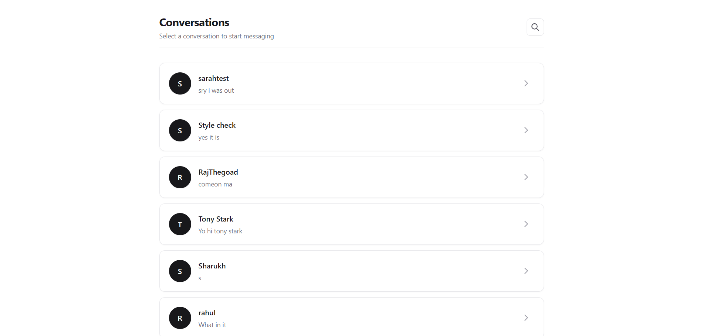

# Chat App — Frontend

Next.js frontend for a real-time chat application, talking to a standalone Express/Socket.io backend over a cross-origin, cookie-authenticated API.

**Backend repo:** [chat-app](https://github.com/moinsayed7/chat-app)
**Live app:** [chat-app-frontend](https://github.com/moinsayed7/chat-app-frontend)

---

## Website Preview



---

## Tech stack

- Next.js (App Router) + TypeScript
- Tailwind CSS
- socket.io-client
- jwt-decode

## Features

- Registration and login against the backend's hand-rolled JWT auth
- Live conversation inbox with last-message previews
- Real-time messaging — sent and received messages appear instantly via a shared Socket.io connection, no polling or manual refresh
- Starting a new conversation with any user via search, without needing to already have an existing thread
- Full message history on page load, live updates layered on top

## Architecture notes

**Cross-domain cookies only work from the browser, not from a Server Component.**

The backend sets the JWT as an `httpOnly` cookie scoped to its own domain (the Render backend URL). A Next.js Server Component runs on Vercel's server, not in the user's browser — when it tries to `fetch()` the backend, it's Vercel's server making that request, and it never had access to a cookie that's scoped to a completely different domain and stored in the *user's* browser. This worked locally only because `localhost:3000` and `localhost:3001` are technically the same host (just different ports), which browsers treat more leniently than genuinely separate domains.

Once deployed to real, separate domains (`*.vercel.app` and `*.onrender.com`), any page needing authenticated data has to fetch client-side, in the browser, using `fetch(url, { credentials: 'include' })` — the same mechanism used for login and registration from the start. This is why `/conversations` and the message-thread page are Client Components rather than Server Components, despite the tradeoff of losing server-side rendering for that data.

**One shared Socket.io connection per chat session, not one per component.**

Both the message list and the send-message form need access to the same live connection — the list to receive `newMessage` events, the form to emit `sendMessage`. A shared parent component (`ChatRoom`) owns the single connection and passes it down, rather than each child opening its own — avoiding duplicate connections registering against the same user in the backend's online-users map.

**`useRef` for a socket instance created via `useEffect` needs care around render timing.** A `useRef`-held socket doesn't trigger a re-render when it's set, so a child component's `useEffect` can run and read the ref *before* the parent's `useEffect` has actually created the socket — a real race condition. Using `useState` instead (which does trigger a re-render on assignment) makes the child correctly re-run its effect once the real socket instance exists.

## Getting started

### Prerequisites
- The backend running locally (or deployed) — see the [backend repo](https://github.com/moinsayed7/chat-app)

### Setup
```bash
npm install
```

Create a `.env.local` file:
```
NEXT_PUBLIC_BACKEND_URL=http://localhost:3000
```

```bash
npm run dev
```

## Pages

| Route | Description |
|---|---|
| `/register` | Create an account |
| `/login` | Log in |
| `/conversations` | Inbox — list of conversations with last-message previews |
| `/conversations/[receiverId]` | Message thread with a specific user; handles both existing and brand-new conversations |
| `/users` | Search for users to start a new conversation with |